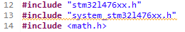

# PWM---STM32L476
Se pretende realizar un ejercicio sencillo e ilustrativo para hacer PWM en la tarjeta STM32L476

El siguiente programa consiste en desvanecer la intensidad luminica de un LED usando la funcionalidad PWM en timmer 4, los LED se encuentran conectados a los pines 12 y 15 del puerto GPIOD, el GPIOD 12 esta conectado al timmer 4 y canal 1.

Como primer paso, se incluyen las librerías y las variables que utilizaremos en el código. La librería math.h es un archivo de la biblioteca de funciones del Lenguaje de programación C  diseñado para operaciones matemáticas básicas sobre valores de tipo double.

